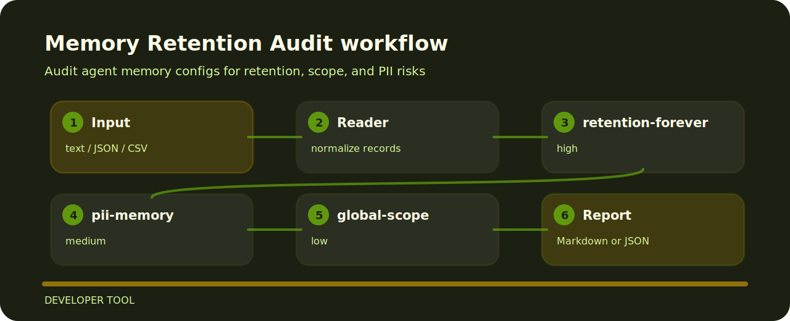

# Memory Retention Audit

Audit agent memory configs for retention, scope, and PII risks.


## How the check reads



## Why this exists

- Targets memory policy instead of broad linting.
- Accepts plain text and returns terminal findings, optional json.
- Keeps each rule visible so the project can be tuned without hunting through prose.

## Decision points

- `retention-forever` - memory retention is unbounded (high); Set a retention period and deletion workflow..
- `pii-memory` - memory may store PII (medium); Add minimization, encryption, and review controls..
- `global-scope` - memory scope is global (low); Use tenant or user isolation for memory..

## Local check

```bash
git clone https://github.com/mertefekurt/memory-retention-audit.git
cd memory-retention-audit
python -m pip install -e ".[dev]"
memory-retention-audit examples/sample.txt
```
